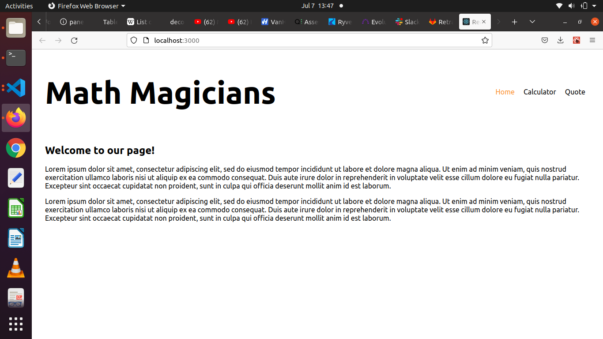
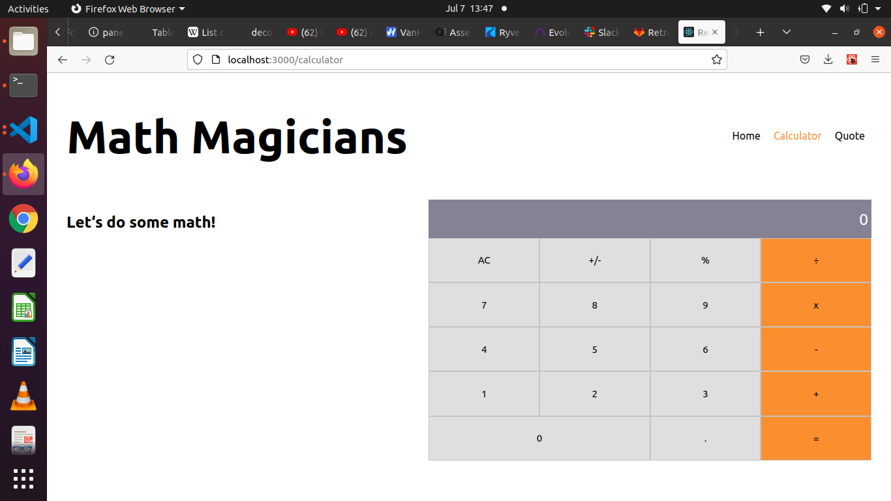
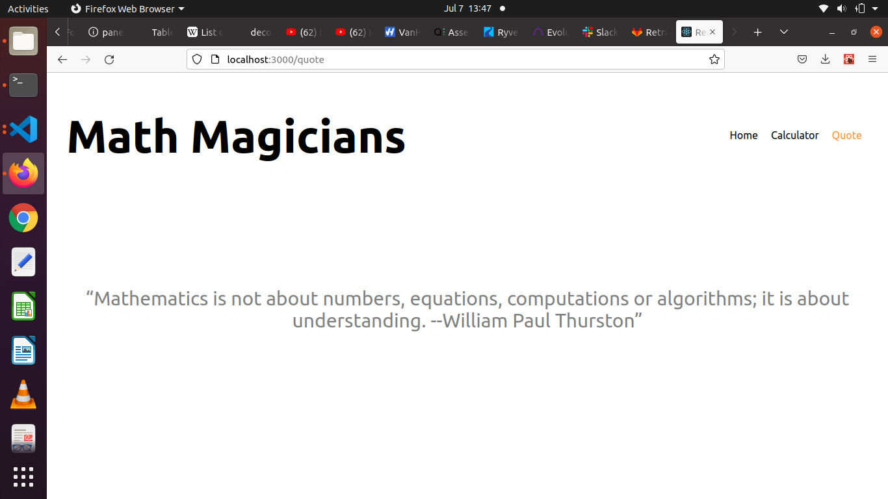

# Math Magicians

> This is the app where you could see information about shows as well as leave likes and comments on your favorite shows.

## Built With

- React
- HTML
- CSS
- JavaScript
- Webpack
- Jest

## Live Demo

[Live Demo Link]()

## Getting Started

Make sur you have the latest version of NodeJS en npm installed locally.

Run the following commands as listed in your terminal:
- git clone https://github.com/patriciachrysy/kanban-board.git
- cd math-magicians
- npm install
- npm run build
- npm start

**Feel free to discover the code and help us improve it**

## Authors

👤 **Patricia**

- GitHub: [@githubhandle](https://github.compatriciachrysy)
  

## 🤝 Contributing

Contributions, issues, and feature requests are welcome!

## Show your support

Give a ⭐️ if you like this project!

## Acknowledgments

- Great team work on the project in Pair Programming
- Thank you for Microverse for providing the required materials

## 📝 License

This project is [MIT](./MIT.md) licensed.
